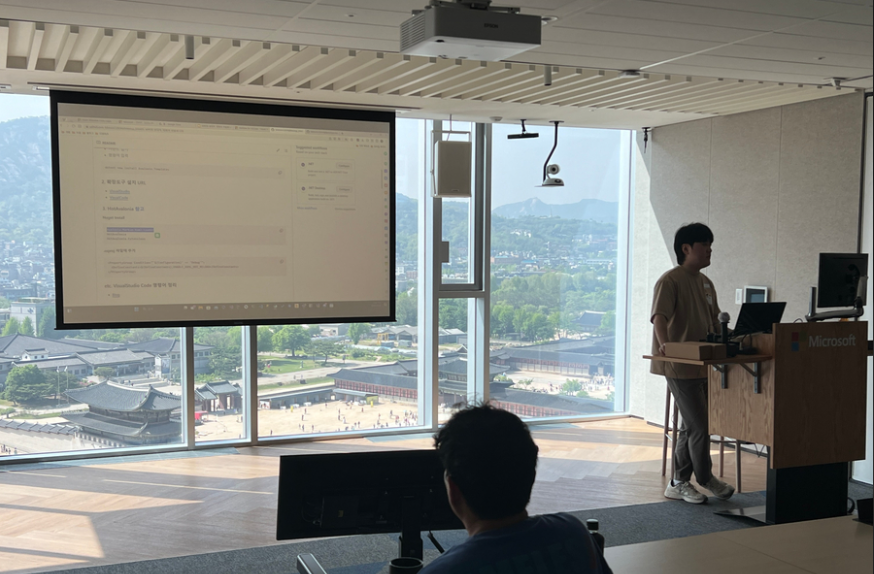

## 개요
2024년 4월 25일, 서울 특별시 종로구 중학동에 위치한 한국마이크로소프트에서 오프라인 행사가 열렸습니다. 이 자리에서 저는 "WPF 현대적 재해석 아발로니아"이라는 주제로 발표를 진행했습니다.

## 발표

**주제** : WPF 현대적 재해석 아발로니아

**목차**

- WPF와 Avalonia UI 차이점
- XAML(AXAML) HotReload
- WPF와 Avalonia 예제 샘플
- DevTools

## 발표 내용
WPF 개발자가 닷넷 기술을 통해 다양한 크로스 플랫폼(Uno, Avalonia, MAUI) 프레임워크를 활용하여 여러 OS 환경에 접근하는 방법을 설명하기 위해 "WPF 현대적 재해석 아발로니아"라는 주제를 선정하여 발표를 진행했습니다.  

### WPF와 Avalonia UI 차이점

WPF와 Avalonia UI의 그래픽 렌더링 방식, 지원되는 OS, UI를 그리기 위한 마크업 언어(XAML vs AXAML)의 차이점을 상세히 소개했습니다. 특히, 각 프레임워크의 장단점을 분석하여 개발자들이 선택할 때 고려해야 할 요소를 강조했습니다.  

### XAML(AXAML) HotReload

Avalonia는 기본적으로 XAML 핫리로드 기능이 제공되지 않습니다. 따라서 핫리로드 기능을 지원하는 서브 라이브러리를 사용해야 합니다. 이 과정에서 다음 두 가지 라이브러리를 소개했습니다:

- [LiveAvalonia]("https://github.com/AvaloniaUI/Live.Avalonia")
- [HotAvalonia]("https://github.com/Kir-Antipov/HotAvalonia")

특히, `HotAvalonia` 라이브러리의 기능과 활용 방법에 대해 중점적으로 설명했습니다.  

### WPF와 Avalonia 예제 샘플

#### AXAML(Avalonia XAML) 다루는 방법(ex Button)

Avalonia의 컨트롤에 스타일을 적용하는 방법은 HTML과 CSS에서 영감을 받아 XAML로 재해석한 부분이 많습니다. 이 과정에서 Avalonia의 XAML이 UI를 표현하는 데 어떻게 활용될 수 있는지를 설명했습니다.

#### Lotto 조회 프로그램

View와 ViewModel을 프로젝트 단위로 분리하고, 하나의 ViewModel에 대해 두 개의 View(WPF, Avalonia) 프로젝트를 샘플로 구성했습니다. 이 작업을 통해 WPF에서 Avalonia, WPF에서 MAUI, WPF에서 Uno로의 다양한 OS에 유연하게 전환할 수 있는 프레임워크를 소개했습니다. View와 ViewModel을 분리함으로써 각 프레임워크 간의 진입 장벽을 낮추는 것을 목표로 했습니다.

#### DataGrid 성능 비교 프로그램
WPF에서 데이터가 많아질수록 DataGrid가 느려지는 문제를 해결하기 위해 Avalonia의 그래픽 기반(Skia)을 활용한 성능 비교 프로그램을 제작했습니다. 테스트 결과, Avalonia는 더 부드러운 사용자 경험을 제공하는 데 성공했습니다. 이 부분은 개발자들에게 Avalonia의 장점을 실질적으로 보여주는 중요한 사례로 작용했습니다.

### DevTools
Avalonia는 웹 기술을 많이 활용하고 있기 때문에 `DevTools`라는 기능이 존재합니다. 이 기능은 Debug 모드에서만 활성화되며, 프로그램에서 선택한 컨트롤의 상태를 실시간으로 확인할 수 있습니다. `F12` 키를 누르면 DevTools가 활성화되어 컨트롤의 pseudo 상태를 볼 수 있고, 임시로 컨트롤 크기를 조정하는 등의 작업을 수행할 수 있습니다.

## 자료 및 링크
- [Git Hub 레포지토리](https://github.com/lukewire129/WpfMeetup_240425)

## 발표 소감
이번 발표를 통해 WPF와 Avalonia UI의 차이점을 깊이 있게 탐구할 수 있었고, 많은 개발자들과의 소중한 교류를 통해 새로운 인사이트를 얻었습니다. 그러나 발표를 진행하는 동안 긴장이 많이 되어 약간의 부정확성이 생기기도 했습니다. 이러한 경험은 다음 번에는 더 신중하게 준비해야겠다는 다짐을 하게 해주었습니다. 앞으로도 이러한 기술적인 탐구를 지속하여 더 많은 개발자들과 정보를 공유하고 협력해 나가고 싶습니다.