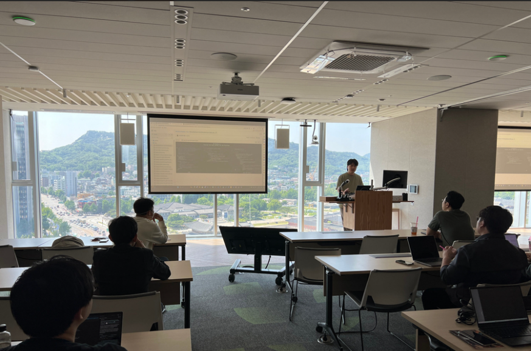

# Blazor MAUI WPF 밋업 - 24년 5월 23일 (
### WPF에서 XAML 없이 UI 그려보기 - feat. CSharpForMarkup
## 개요
2024년 5월 23일, 서울 특별시 종로구 중학동에 위치한 한국마이크로소프트에서 오프라인 행사가 열렸습니다. 이 자리에서 저는 "WPF에서 XAML 없이 UI 그려보기 - feat. CSharpForMarkup"이라는 주제로 발표를 진행했습니다.

## 발표

**주제** : WPF에서 XAML 없이 UI 그려보기 - feat. CSharpForMarkup

**목차**

- CSharpForMarkup 적용해보기

## 발표 내용
첫 발표에서의 실수로 인해 이번에는 부담을 줄이기 위해 좀 더 가벼운 주제를 선택했습니다. 특히 XAML과 MVVM 패턴에 대한 개발자들의 거부감을 해결하는 방법을 고민하던 중, GitHub에서 CSharpForMarkup이라는 오픈 소스를 발견하게 되었고, 이를 활용해 WPF에서 XAML 없이 UI를 구성하는 방법을 주제로 삼았습니다.

발표에서는 XAML 파일 없이 C# 코드로 UI를 구성하는 방법을 중점적으로 다루었고, 이를 통해 WPF 개발자들이 더 직관적으로 UI를 설계할 수 있는 방법을 설명했습니다.

### CSharpForMarkup 적용해보기
1. WPF 프로젝트를 생성한 후 기본적으로 포함된 MainWindow.xaml과 App.xaml 파일을 제거하는 과정부터 시작했습니다.
2. NuGet 패키지 관리자를 통해 CSharpMarkup.WPF 패키지를 다운로드한 후, 이를 프로젝트에 적용하는 방법을 설명했습니다.
3. 프로젝트 구조를 정리하고 Startup, Application, MainWindow 또는 MainPage, 그리고 GlobalUsing 클래스를 생성하고, 이를 통해 프로젝트를 동작시키는 과정을 시연했습니다.

또한, 발표 중에는 CSharpForMarkup을 어떻게 쉽게 사용할 수 있는지 설명하고, 기존 XAML을 사용하는 방식보다 코드 기반 UI 설계의 장점을 강조했습니다.

## 자료 및 링크
- [LukeWpfMarkup](https://www.nuget.org/packages/LukeWpfMarkup/)
- [Git Hub 레포지토리](https://github.com/lukewire129/LukeMauiMarkup)

## 발표 소감
이번 발표에서는 지난번 발표의 부담감으로 인해 실수가 많았던 경험을 되돌아보며, 좀 더 가볍고 실용적인 주제로 발표를 준비했습니다. 특히 제가 개발한 `LukeMauiMarkup`은 `CommunityToolkit.Maui.Markup`을 쉽게 사용할 수 있도록 패키징한 것이었는데, 이를 기반으로 `LukeWPFMarkup`도 `CSharpForMarkup.WPF`를 더욱 손쉽게 사용할 수 있도록 패키징했다는 점을 발표에서 강조했습니다.

사람들 앞에서 기술을 설명하는 데 있어서 여전히 긴장과 부담이 있었지만, 이번 발표를 통해 그 두려움을 조금씩 극복할 수 있었습니다. 특히 발표 과정에서 실무적인 예제를 통해 기술을 설명하고, 청중들이 더 쉽게 이해할 수 있도록 노력했습니다. 앞으로 더 많은 연습과 경험을 통해 발표 실력을 개선하고, 개발자로서도 더 성장해 나가야겠다는 다짐을 하게 되었습니다.

