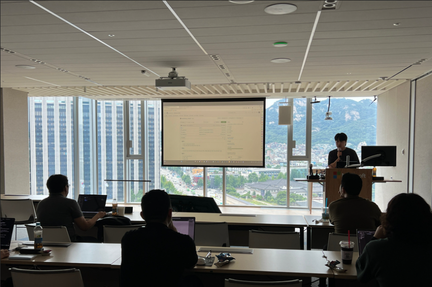
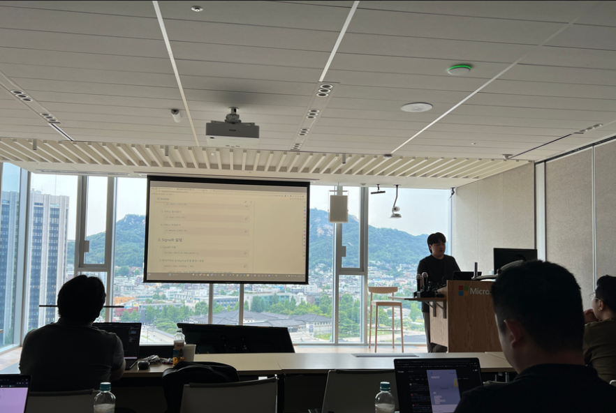

## 개요
2024년 6월 27일, 서울 특별시 종로구 중학동에 위치한 한국마이크로소프트에서 오프라인 행사가 열렸습니다. 이 자리에서 저는 "윈도우서비스를 통한 나만의 알림봇 만들기"이라는 주제로 발표를 진행했습니다.

## 발표

**주제** : 윈도우서비스를 통한 나만의 알림봇 만들기

**목차**

- 로컬 서비스 프로그램 만들기
- 알림센터 알림 메세지 적용하기

## 발표 내용
이번 발표에서는 윈도우 서비스에 등록된 프로그램을 통해 DB나 일정 데이터를 기반으로 정해진 주기에 맞춰 알림을 제공하는 시스템을 구축하는 과정을 다루었습니다. 특히 개발자로서 직접 윈도우 서비스를 통해 알림 시스템을 설계하고 구현하는 방법을 설명하며 실용적인 예제를 소개했습니다. 

### 로컬 서비스 프로그램 만들기
먼저 `POST`, `PUT`, `GET` 요청을 처리하는 로컬 API 서버를 구축하고, 이를 윈도우 서비스에 등록하는 과정에 대해 시연했습니다. 그런 다음, 알림 시간이 되면 SignalR 서버를 통해 클라이언트에 실시간 알림을 전송하는 방식도 함께 설명하였습니다. 해당 과정에서 윈도우 서비스와 SignalR의 역할을 명확히 구분하고, 서버가 지속적으로 실행되며 스케줄에 맞춰 알림을 발송하는 시나리오를 제시했습니다.

### 알림센터 알림메세지 적용하기
그 후, 윈도우 우측 하단의 알림센터(Notification Center)에 알림 메시지를 등록하는 기능을 시연했습니다. WPF 프로그램을 통해 알림이 어떻게 동작하는지 보여주며, 알림 메시지를 사용자 친화적으로 구성하는 방법과 관련된 노하우도 함께 공유했습니다. 이 과정을 통해 청중들이 실제 윈도우 환경에서 알림을 구현하는 법을 이해할 수 있도록 했습니다.

## 기술 스택
발표 중에는 다음과 같은 기술 스택을 활용했습니다:

- **Windows Services**: 윈도우 서비스 기반 프로그램의 기본적인 설계 및 등록 방법.

- **SignalR**: 실시간 알림 전송을 위한 
서버-클라이언트 간 통신 구현.

- **UWP Notifications**: 알림 메시지를 윈도우 알림 센터에 띄우는 방법.

## 자료 및 링크
- [WindowServices](Microsoft.Extensions.Hosting.WindowsServices)
- [Uwp Notifications](Microsoft.Toolkit.Uwp.Notifications)
- [Git Hub 레포지토리](https://github.com/lukewire129/WpfMeetup_240627)

## 발표 소감
이번 발표에서는 프로젝트를 완성된 형태로 보여주기보다는, 아직 개발 중인 상태에서 청중에게 전체적인 구조와 원리를 설명하는 데 초점을 맞췄습니다. 발표 이후에도 프로젝트를 지속적으로 업데이트할 계획이며, 이를 기반으로 더 완성된 알림 시스템을 구축할 예정입니다.

발표 중에는 여전히 긴장하여 약간 횡설수설한 부분도 있었지만, 첫 발표에 비해 많이 나아진 점을 느낄 수 있었습니다. 특히 복잡한 주제를 설명하면서도 더 자신감 있게 소통하려고 노력했으며, 윈도우 서비스와 알림 시스템에 대한 흥미를 청중에게 전달할 수 있어 뜻깊은 시간이었습니다.