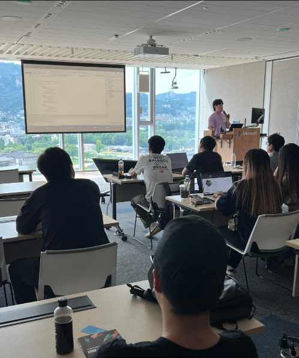
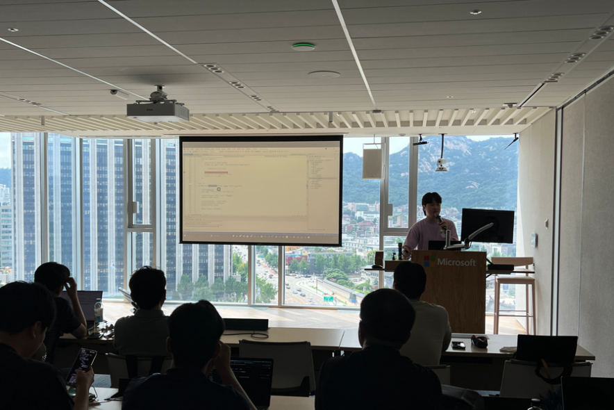

## 개요
2024년 7월 25일, 서울 특별시 종로구 중학동에 위치한 한국마이크로소프트에서 오프라인 행사가 열렸습니다. 이 자리에서 저는 "선언형? MVU? MauiReactor? 도대체 그게 뭔데?"이라는 주제로 발표를 진행했습니다.

## 발표

**주제** : 선언형? MVU? MauiReactor? 도대체 그게 뭔데?

**목차**

- 선언형 UI
- MVU 패턴
- MauiReactor
- 샘플 프로젝트 소개

## 발표 내용
이번 발표는 WPF 대신 MAUI에서 사용되는 새로운 패러다임과 라이브러리를 소개하고자 준비했습니다. 특히 MAUI 개발에서 활용되는 MVU 패턴을 중심으로, 해당 패턴을 지원하는 라이브러리인 `MauiReactor`를 소개하며, 이를 활용해 어떻게 선언형 UI를 구성하는지 설명했습니다. 

### 선언형 UI
명령형 UI와 선언형 UI의 차이를 비교하며, 선언형 UI의 장점과 특성을 설명했습니다. 특히 선언형 방식이 코드의 가독성과 유지보수성을 어떻게 향상시키는지에 대한 논의를 포함했습니다.

### MVU 패턴
MVU(Model-View-Update) 패턴의 구조와 작동 원리를 그림을 통해 설명했습니다. 모델을 기반으로 뷰를 그려내는 방식, 그리고 데이터 흐름의 단순화와 유지보수의 용이성을 강조했습니다.

### MauiReactor
`MauiReactor`는 `Flutter`의 StatelessWidget과 StateWidget 개념, 그리고 `React`의 상태 관리 방식을 결합한 라이브러리로, MAUI 개발에서 선언형 UI를 구현할 수 있는 도구입니다. 이 라이브러리를 활용해 간단한 UI를 어떻게 구성하고 상태를 관리할 수 있는지 시연했습니다.

### 샘플 프로젝트 소개
발표 중 `MauiReactor`를 사용하여 간단한 샘플 프로젝트를 만들어, 라이브러리가 실제로 어떻게 동작하는지 보여주었습니다.

## 자료 및 링크
- [MauiReactor발표자료](https://www.canva.com/design/DAGMZZ7PfJs/jMdYgbkqE0jM2HHxI_Tyrw/edit?utm_content=DAGMZZ7PfJs&utm_campaign=designshare&utm_medium=link2&utm_source=sharebutton)

## 발표 소감
이번 발표는 WPF 개발에 치중하지 않고, UI 개발 전반에 대한 관심을 바탕으로 MAUI의 `MauiReactor` 라이브러리를 소개하는 데 집중했습니다. 특히 닷넷 개발자들 사이에서 생소한 MVU 패턴을 처음 소개하는 자리가 되었고, 많은 참가자가 이 패턴에 대해 잘 알지 못했다는 점에서 의미 있는 발표였다고 생각합니다. 앞으로도 이러한 새로운 개념과 패턴을 더욱 널리 알리기 위해 노력할 예정입니다.
