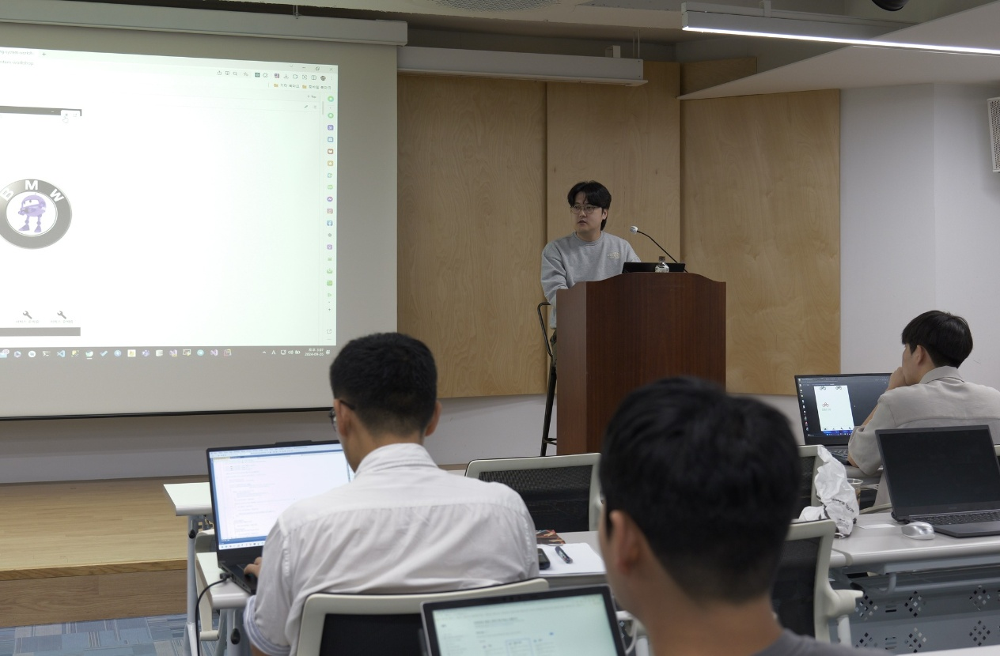

## 개요
2024년 9월 29일, 서울 서대문구 연희로 2길 62 (한빛빌딩) B동 1층 리더스 홀에서 한빛미디어 주관으로 오프라인 행사가 열렸습니다. 이 자리에서 저는 아발로니아(Avalonia) 섹션을 맡아 워크샵 형태로 발표를 진행했습니다.

## 발표

**주제** : 공유 자전거 플랫폼 만들기

**내용** : 이번 워크샵에서는 오전에는 API 서버를 구축하고, 이를 바탕으로 오후에는 우노(Uno), 아발로니아(Avalonia), 마우이(MAUI) 프레임워크를 통해 각 주제에 맞는 애플리케이션을 개발하는 과정을 발표했습니다.
아발로니아 섹션에서는 대여소의 전체 정보와 자전거 정보를 제공하는 간단한 UI를 만들면서, 아발로니아의 XAML에서 활용할 수 있는 다양한 스타일링 기법을 공유했습니다.

### Template 개발 및 배포
워크샵 특성상 많은 인원과 함께하는 행사였기 때문에 기본 파일과 리소스를 처리하는 데 혼선이 없도록 미리 템플릿을 개발해 배포했습니다. 이 덕분에 참가자들이 큰 문제 없이 발표 내용을 따라올 수 있었고, 행사 진행 중 짜잘한 문제들은 잘 해결되었습니다.

### MVVM의 새로 개발 접근 방법
MVU 패턴에서 받은 영감을 바탕으로, 이번 발표에서는 MVVM을 새로운 방식으로 접근해 보았습니다. 전통적인 ViewModel 중심의 개발 방식이 아닌, Model을 중심으로 UI를 설계하는 방식이었습니다. Model 생성자에 DTO를 직접 넣어 자연스러운 모델 생성을 유도했으며, View와 ViewModel 간의 명령 처리와 로드 명령을 자연스럽게 연결하는 과정을 보여주었습니다.

### VisualStudio와 Rider IDE 툴의 차이
발표 준비 과정에서 Visual Studio와 Rider IDE가 Template Control을 생성할 때 파일 구조에 차이가 있다는 점을 발견했습니다. 이를 발표 막바지에 깨달아, 청중들이 혼란스러워하기 전에 미리 문제를 해결할 수 있었습니다.

## 자료 및 링크
- [템플릿](https://www.nuget.org/packages/BicycleSharingAvalonia.Template/)
- [Github 저장소](https://github.com/blazorstudy/bicycle-sharing-system-workshop)

## 발표 소감
이번 발표는 제가 처음으로 워크샵 진행자로 나선 자리였습니다. 100여 명의 청중 앞에서 발표하는 것은 매우 부담스러운 경험이었지만, 이를 해소하기 위해 세세한 부분까지 신경 써서 준비했습니다만 예상치 못하게 발표 진행에 필요한 `Readme` 파일이 일부 지워지는 바람에 당황했던 순간도 있었습니다. 다행히 미리 준비한 템플릿과 백업 덕분에 큰 문제 없이 발표를 마칠 수 있었고, 이 과정에서 철저한 준비의 중요성을 다시 한 번 느꼈습니다.

덕분에 아발로니아에 대한 깊은 이해를 쌓을 수 있었고, 다양한 개발 경험을 가진 참가자들과의 상호작용을 통해 많은 것을 배울 수 있었습니다. 앞으로 워크샵 진행에 대해 더 자신감을 가질 수 있을 것 같고, 이러한 기회를 통해 배운 점들을 바탕으로 더욱 성장할 수 있겠다는 생각이 들었습니다.
