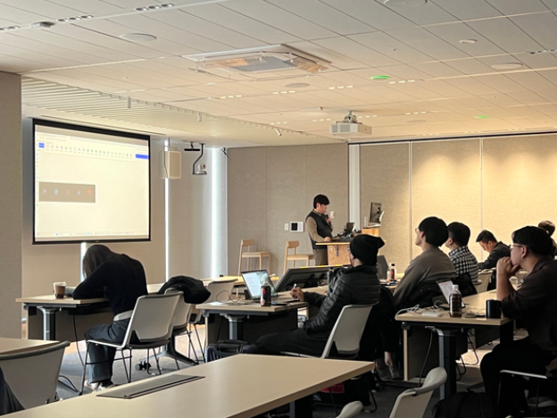
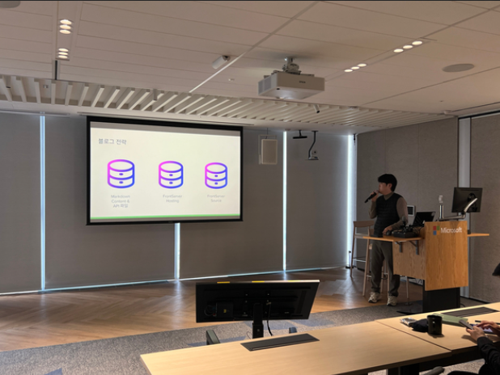

# Blazor MAUI WPF 밋업 발표 후기
### 아발로니아로 만든 githubpage 체험기
## 개요
2025년 1월 21일, 서울특별시 종로구 중학동에 위치한 한국마이크로소프트에서 Blazor, MAUI, WPF 관련 오프라인 밋업 행사가 열렸습니다.
이 자리에서 저는 **“아발로니아로 만든 GitHub Pages 체험기”**라는 주제로 발표를 진행했습니다.

## 발표

**주제** : 아발로니아로 만든 githubpage 체험기

**목차**

- 왜 블로그 플랫폼을 바꾸려고 했을까?
- Velog에서의 계정 충돌 문제
- GitHub Pages를 선택한 이유
- 아발로니아로 직접 만들어보자!
- 블로그 전략
- Github Actions를 통한 API 파일 생성
- 문제와 실패한 이유
- 리액트로의 전환: 잘 관리하는 블로그
- 아발로니아 갤러리: 아발로니아 프로젝트 모음
  
## 발표 내용

### 블로그 플랫폼을 바꾸려던 이유

처음에는 **네이버 블로그**를 사용하고 있었습니다.  
하지만 단락 정리, 텍스트 꾸미기, 이미지 삽입 등에서 제 미적 감각에 한계를 느꼈고,  
보다 깔끔하고 일관된 **마크다운 기반의 블로그**를 원하게 되었습니다.  
그래서 자연스럽게 **Velog**로 이전을 고려하게 되었습니다.

---

### Velog에서의 계정 충돌 문제

기존에 몇 개의 글을 작성해둔 Velog 계정이 있었는데,  
계정 통합 과정에서 충돌이 발생했습니다.  

새 계정에서 글을 작성했음에도  
예전 계정에 글이 등록되는 등 **알 수 없는 계정 충돌 현상**이 있었고,  
이 문제로 Velog도 포기하게 되었습니다.

> **"차라리 내가 직접 만들어보자!"**  
> 그렇게 제 개인 블로그 개발 여정이 시작됐습니다.

---

### GitHub Pages를 선택한 이유

- **무료 호스팅**이 가능하고  
- **배포 과정도 간단**하며  
- **개인 프로젝트에 최적화된 플랫폼**

제가 원하던 플랫폼 그 자체였습니다.

---

### 아발로니아로 직접 만들어보자!

- Jekyll 테마는 익숙하지 않은 프레임워크였고  
- HTML과 CSS까지 다뤄야 한다는 점이 부담이었습니다  

> 단순히 블로그를 쓰고 싶을 뿐인데...

그러다 Avalonia가 **웹으로도 빌드 가능**하고  
**GitHub Pages로 배포도 가능**하다는 걸 알게 되었습니다.  

> **"이거다!"** 싶었죠.

---

### 블로그 전략

일반적으로 Jekyll 기반 블로그는  
**프론트와 데이터를 함께 보관**합니다.  

하지만 Avalonia로 블로그를 만든 선례가 없었기에  
실패를 대비해 **데이터와 프론트를 분리**하는 전략을 택했습니다.

- **데이터**는 별도 레포지토리에서 관리  
- **프론트**는 독립된 프로젝트로 구성  

---

### GitHub Actions를 통한 API 파일 생성

- `Data` 레포지토리의 `main` 브랜치에 Push가 발생하면  
- GitHub Actions가 자동으로 실행되어  
- JavaScript 스크립트를 수행합니다

이 스크립트는 마크다운과 메타데이터를 파싱하여  
- 글 목록  
- 태그 목록  
을 **JSON 파일**로 생성합니다.  

이렇게 만든 데이터는 **Avalonia 프론트에서 읽어들이는 구조**입니다.

> 처음엔  
> **"이제 새로운 프레임워크 패러다임을 만들었구나!"**  
> 라는 희망회로도 돌렸습니다.

---

### 문제와 실패한 이유

#### 1. Markdown 렌더링 한계

Avalonia에서 마크다운을 렌더링할 수 있는 `Markdown.Avalonia` 라이브러리는  
- **Desktop / Android / iOS**에서는 하이퍼링크가 동작하지만  
- **Web에서는 미지원**이었습니다.

#### 2. 폰트 적용 문제

`Markdig`로 마크다운을 HTML로 변환한 뒤  
`Avalonia.HtmlRenderer`로 렌더링을 시도했으나:

- **폰트 인코딩 이슈**  
- **웹폰트 미적용 문제**  

결과적으로 **가독성이 떨어졌고**,  
기술적으로 블로그는 완성했지만,  
**기능적인 마무리가 되지 않아 실패**로 판단할 수밖에 없었습니다.

---

### 리액트로의 전환: 잘 관리되는 블로그

결국 현재 회사에서 사용 중인 기술인 **React**를 활용해  
블로그를 다시 만들게 되었습니다.

- HTML과 CSS를 직접 다루는 것도 감수했고  
- 지금은 글도 잘 올라가고  
- 부족한 점도 그때그때 수정하며  
- **지속적으로 관리 가능한 블로그**로 운영 중입니다.

---

### [아발로니아 갤러리](https://delightful-profiterole-0fa25d.netlify.app/): 아쉬움을 기회로

비록 **아발로니아 블로그는 마크다운 이슈로 실패**했지만,  
아발로니아로 만든 **프론트 자체는 GitHub Pages에서 잘 동작**하고 있었습니다.

이걸 그냥 버리기 아까워,  
기존에 만들어 둔 **SNS나 WPF 컴포넌트들**을 Avalonia로 마이그레이션하여  
**"아발로니아 갤러리"**라는 형태로 재탄생시켰습니다.

- 다양한 컴포넌트를 정리해볼 수 있었고  
- 나만의 컨트롤들을 추가해가며  
결과적으로 **하나의 완성도 높은 프로젝트**로 자리잡았습니다.

---

### 발표를 마치며

Avalonia로 만든 블로그는 아쉽게도 **기술적인 한계로 실패**했지만,  
그 경험은 저에게 **“아발로니아 갤러리”라는 새로운 결과물**로 이어졌습니다.

이제는  
- 어떤 컨트롤을 더 만들어볼까?  
- 어떤 기능을 확장해볼까?

**개발자로서 더 나아가야 할 방향에 대한 도전과 호기심**을 갖게 해준  
소중한 경험이었습니다.
