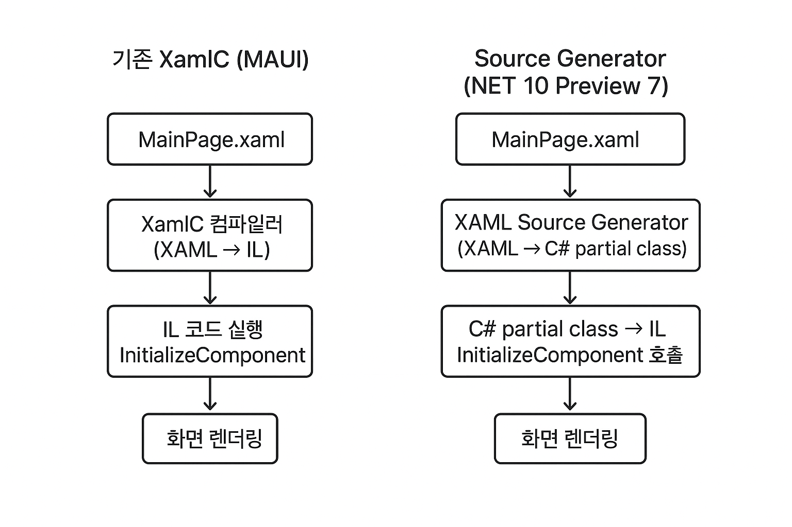

# .NET MAUI: XAML Source Generator로 달라진 개발 경험
.NET 10 Preview 7에서 도입된 XAML Source Generator는 기존의 XamlC 컴파일 방식을 완전히 대체하며, .NET MAUI 개발 환경을 한 단계 끌어올렸습니다. 이는 단순한 성능 향상을 넘어 개발 워크플로우 전반에 걸쳐 혁신적인 변화를 가져왔습니다.

---
### 기존 XamlC 방식의 한계
이전까지 .NET MAUI는 `XamlC`라는 별도 컴파일러를 사용하여 **XAML을 IL(Intermediate Language)** 코드로 변환했습니다. 이 방식은 `LoadXaml()`과 같은 메서드를 통해 **런타임에 UI를 구성**했기 때문에 몇 가지 한계가 있었습니다. XAML에 문법적인 오류가 있어도 빌드 시에는 발견하기 어려웠고, 오류가 발생하면 앱이 실행되는 **런타임** 후 에야 문제를 확인할 수 있어 디버깅이 번거로웠습니다.

---
### XAML Source Generator의 혁신적인 변화
새로운 **XAML Source Generator**는 이러한 한계를 극복합니다.  Roslyn 컴파일러에 통합된 이 기능은 XAML 파일을 읽어 **C# 소스 코드**를 직접 생성합니다. 이 생성된 코드는 `.xaml.sg.cs` 파일에 포함되며, `InitializeComponent()` 메서드 내에서 모든 UI 요소와 속성을 명시적으로 초기화합니다.

이러한 변화는 다음과 같은 핵심적인 장점을 제공합니다.

- **컴파일 타임 검증**: XAML에 오류가 있으면 C# 코드로 변환하는 과정에서 Roslyn이 즉시 **빌드 오류**를 발생시킵니다. 이를 통해 개발자는 런타임에 의존하지 않고도 문제를 미리 해결할 수 있습니다.

- **개발 경험 개선**: 생성된 C# 코드를 직접 확인할 수 있으므로, 코드 비하인드에서 **향상된 IntelliSense**와 **타입 안전성**을 얻을 수 있습니다.

- **더 빠른 빌드**: Roslyn의 효율적인 **증분 빌드** 파이프라인 덕분에, XAML 파일의 작은 수정에도 전체를 다시 빌드할 필요 없이 필요한 부분만 빠르게 반영됩니다.

- **안정적인 핫 리로드**: 코드 생성 방식이 개선되면서 핫 리로드의 안정성과 속도가 크게 향상되어, XAML 수정 후 UI 변화를 더 부드럽게 확인할 수 있습니다.
---
### WPF와의 차이점

| 구분 | WPF | MAUI (기존) | MAUI (.NET 10~) |
|------|-----|-------------|-----------------|
| 빌드 산출물 | BAML | IL 코드 | C# partial class → IL |
| 런타임 로딩 | BAML 파싱 | IL 실행 | IL 실행 |
| 디버깅 편의성 | 제한적 | 제한적 | **생성 코드 확인 가능** |
| 핫리로드 | 느림 | 빠름 | **더 빠름** |

---

### 결론: 왜 지금 사용해야 하는가?

XAML Source Generator는 MAUI 개발자에게 **안정성, 생산성, 그리고 예측 가능한 개발 환경**을 제공합니다. 런타임에만 의존하던 기존 방식에서 벗어나, XAML 작성부터 빌드, 디버깅까지 모든 과정이 더 빠르고 효율적으로 변모했습니다. **.NET 10 Preview 7**부터 이 강력한 기능이 기본으로 포함되었으니, MAUI 개발자라면 새로운 프로젝트에 적극적으로 적용해보는 것을 강력히 추천합니다.