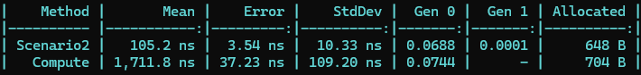
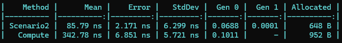

# PacketSupoort 라이브러리 소개

안녕하세요, 이광석입니다.

오늘은 제가 만든 `PacketSupoort` 라이브러리를 소개하려 합니다. 이 라이브러리는 Byte 통신을 보다 쉽고 직관적으로 처리할 수 있도록 설계된 도구입니다.

## 왜 PacketSupoort일까?
사실 PacketSupport가 맞습니다. 올리는 과정에서 오타를 쳤고 수정을 할 수 없다는 것을 뒤늦게 알았습니다.

## 왜 만들었을까?

Byte 통신을 다루다 보면, 필연적으로 ByteArray 처리가 필요합니다. 고정된 값일 때는 `byte 배열`을 사용해 쉽게 처리할 수 있겠지만, 상황에 따라 동적으로 데이터를 추가해야 하는 경우에는 `IEnumerable<byte>`로 값을 추가하고 `ToArray` 메서드를 통해 최종 ByteArray를 생성하는 방법을 많이 사용합니다.

하지만 긴 ByteArray를 처리할 때는 코드가 점점 복잡해지고, 나중에 코드를 다시 읽을 때 "이게 뭐지?" 싶을 정도로 가독성이 떨어질 수 있습니다. 특히 패킷 프로토콜의 특성상 데이터를 Ascii로 변환하거나 다양한 방식으로 조작해야 하는 경우, 코드가 더 번잡해지기 마련이죠.

그래서 저는 이를 간결하고 명확하게 처리할 수 있는 방법을 고민했고, 체인 메서드 형식의 프로토콜 메시징 라이브러리인 `PacketSupport`를 개발하게 되었습니다. 이 라이브러리는 ByteArray를 다루는 과정을 좀 더 직관적으로 만들어주며, 복잡한 패킷 생성 과정을 단순하게 체인으로 연결하여 쉽게 구현할 수 있게 도와줍니다. 또한, `IEnumerable<byte>`의 `Add` 느낌과 비슷하지만, 성능 면에서 훨씬 더 우수합니다.

## `PacketSupport`의 주요 기능

- **체인 메서드 지원**: 패킷의 각 부분을 체인 형식으로 쉽게 추가할 수 있어, 가독성과 유지보수성을 높였습니다.
- **ASCII 변환 지원**: 패킷 데이터를 쉽게 Ascii 문자열로 변환하여 프로토콜의 요구사항을 맞출 수 있습니다.
- **간단한 사용법**: 직관적인 API로 복잡한 패킷 생성 과정을 줄이고, 개발자가 프로토콜의 로직에 집중할 수 있도록 했습니다.

## 사용 예시

```csharp
var packet = new PacketBuilder()
    .AppendByte(0x01)
    .AppendBytes(new byte[] { 0x02, 0x03 })
    .AppendString("Hello")
    .Build();
```

위 코드처럼, `PacketBuilder`를 사용해 체인 형식으로 패킷을 구성할 수 있습니다. 이렇게 하면 각각의 단계가 명확히 드러나며, 무엇을 추가하고 있는지 쉽게 파악할 수 있습니다.

`PacketSupport`를 통해 여러분의 Byte 통신 코드가 더욱 깔끔해지고, 프로토콜 메시징 작업이 훨씬 쉬워지기를 바랍니다.

## 성능 비교표 (IEnumerable<byte>의 PacketBuilder vs PacketBuilder)

다음 코드를 가지고 밴치마크를 돌려본 것입니다.
```csharp
// Scenario2
public void Scenario2()
{
    var caseString = new PacketBuilder ()
.@string (new string ('A', 65));
}

// Compute
public void Compute()
{
    var caseBinary = new PacketBuilder ()
                 .@byte (1)
                 .@short (1)
                 .@ushort (1)
                 .@int (1)
                 .@uint (1)
                 .@long (1)
                 .@ulong (1)
                 .@byte (1)
                 .@short (1)
                 .@ushort (1)
                 .@int (1)
                 .@uint (1)
                 .@long (1)
                 .@ulong (1)
                 .Compute (Checksum8Type.Xor);
}
```
 코드 리팩토링 전 (IEnumerable<byte>기반의 PacketBuilder)


코드 리팩토링 후 (현재 PacketBuilder)


수치상으로만 봐도 많은 개선이 이루어졌음을 알 수 있습니다. 이전 `IEnumerable<byte>` 기반의 PacketBuilder나 일반 `IEnumerable<byte>`의 경우, Byte의 수가 많아질수록 데이터 조합이 많아지고, 이에 따라 메모리 사용량이 급격히 증가했을 것입니다. 현재의 `PacketBuilder`는 이러한 문제를 해결하고, 성능을 크게 향상시켰습니다.

## 앞으로 목표?

패킷 프로토콜 방식은 장비가 존재하는 한 기본적으로 필요한 요소입니다. 그렇기 때문에 `프로토콜 문서를 코드에 그대로 기입하여 가독성이 높은 프로토콜 통신용 코드를 만드는 것`이 목표입니다. 이를 통해 누구나 쉽게 프로토콜의 내용을 이해하고 유지보수할 수 있는 환경을 만들고자 합니다.


