안녕하세요 개발자 이광석입니다.

ConfuserEx를 통해서 WPF 프로그램 난독화 하는 방법을 공유해볼까 합니다.

## 소스 다운로드
우선 오픈소스를 다운로드 받습니다.
```
git clone https://github.com/mkaring/ConfuserEx
```

솔루션을 열어보면 `#.CLI`,`#.Core`,`#.DynCipher`,`#.MSBuild.Tasks`,`#.Protections`,`#.Renamer`,`#.RunTime`,`ConfuserEx`의 프로젝트들이 존재합니다.
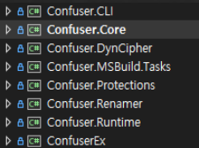

(우린 난독화를 하기 위해서 소스를 다운한거니 세부적인 분석은 각자 알아서하는걸로..)

우리가 필요한 녀석들인 `Confuser.CLI`, `ConfuserEx` 입니다.

**ConfuserEx**
 - 난독화를 위해 파일(.csproj)를 생성과 실행시켜주는 프로젝트입니다.

**Confuser.CLI**
 - 난독화를 위해 작성된 파일(.csproj)를 콘솔 명령으로 실행시켜주는 프로젝트입니다.

## 난독화 되지 않는 프로그램 디컴파일 해보기
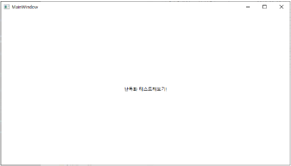
위 프로그램을 디컴파일을 통해서 열어보도록 하겠습니다.
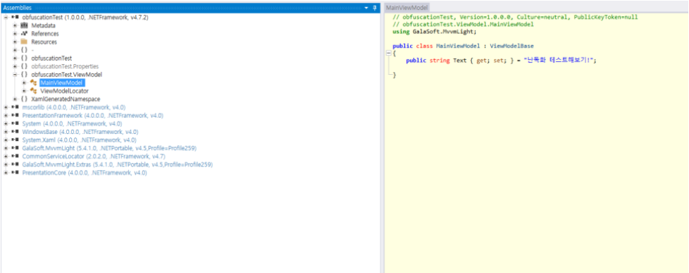

## 난독화 .csproj 만들기
1. `ConfuserEx`를 프로젝트를 빌드 후 실행
2. 빨간색 동그라미를 통해 난독화하고자 하는 파일 선택을하여 난독화하고자 하는 파일의 상위 폴더 경로를 선택 합니다. (경로만 선택하기 때문에 아무것도 없습니다!)
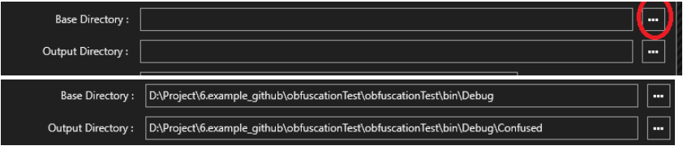

※ 설정하고나면 Output Directory 경로가 자동으로 Confused라고 잡히는데 
('원본 파일이 필요없다' 하시는 분들 Confused경로를 지우시면됩니다.)

3. 해당 버튼을 누르고 난독화 하고자 하는 파일을 선택 해줍니다.
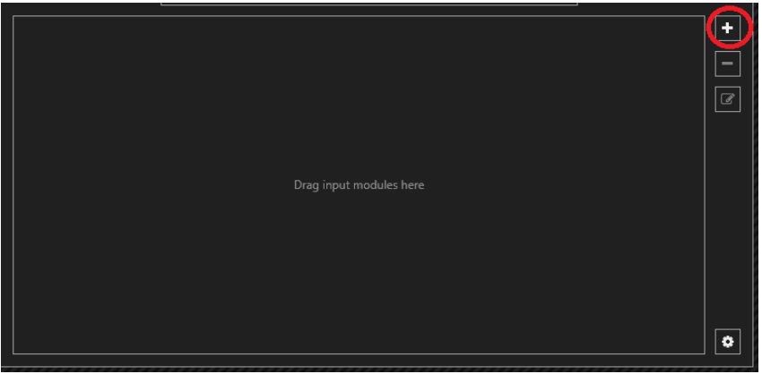

4. 난독화 강도 선택하기! (강도라고 하기엔..전문적이진 않지만.. 쉽게쉽게 이해를 위해 단어 선택하였으니 양해바랍니다..)
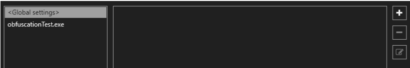

- 파일 개별적으로 설정하고자 한다면 `obfusctionTest.exe`를 누르고 옆에 플러스버튼을 누르기
- 전체 프로그램에 적용할 것이다 할 경우엔 `<Global settings>`를 누르고 옆에 플러스 버튼을 누르기

5. 해당 버튼 난독화 규칙을 정해주기 위해 버튼을 클릭합니다.
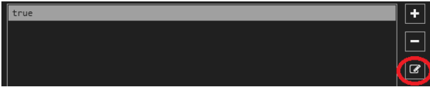

6. `Maximum`을 선택 후 `Done` 버튼을 누릅니다.
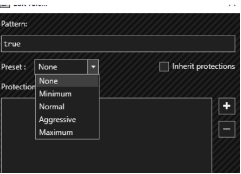

## 난독화 실행
1. `Protect` 탭으로 이동후 `Protect`버튼을 누릅니다.


2. 아래 Fished로 초록색 텍스트가 나온다면 정상처리 됩니다.
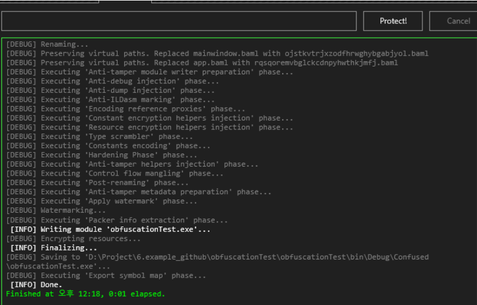

## 난독화 결과보기
기존 코드가 어떻게 되었는지 소스코드 추측조차 보이지 않게 되었습니다.
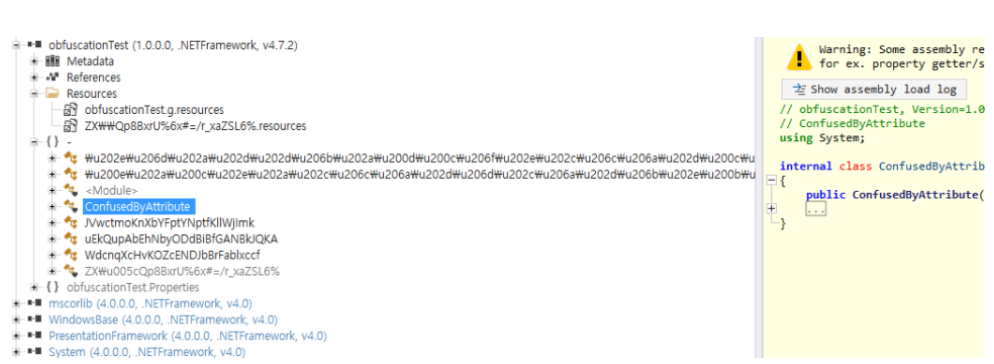

## Confuser.CLI를 통해 난독화 해보기
1. 이전 `난독화 .csproj 만들기`을  `Save project` 버튼을 통해서 저장합니다. 


2. Confuser.CLI 프로젝트를 빌드 후 빌드된 위치로 이동합니다.
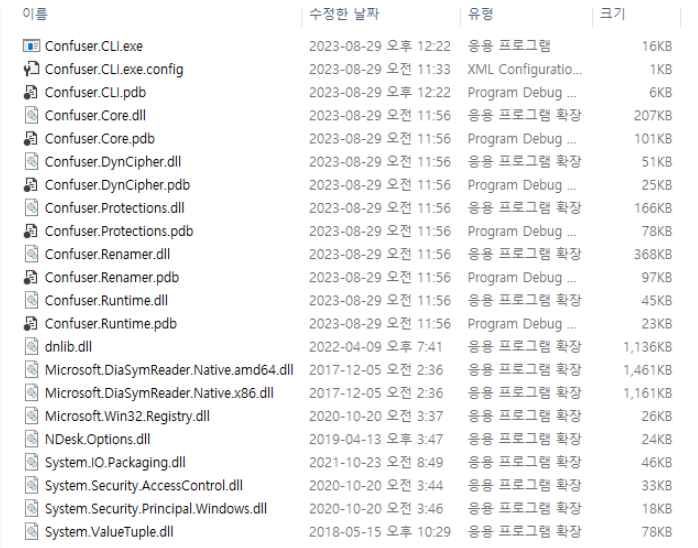

3. 해당 폴더 기준으로 `커맨드창` 또는 `PoserShell`을 띄어줍니다. 
다음 명령어를 입력 후 실행합니다.
```
`Confuser.CLI {csproj 절대경로 또는 상대경로}`
```
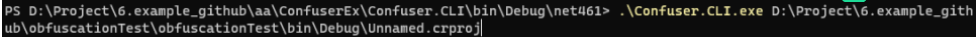
4. 이전 `ConfuserEx`의 `Protect` 때와 동일한 화면이 나옵니다.
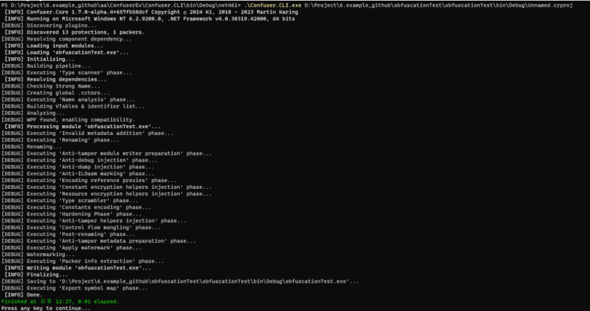