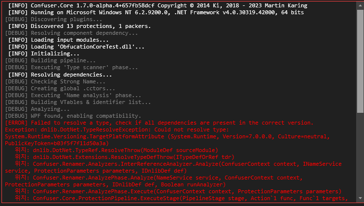
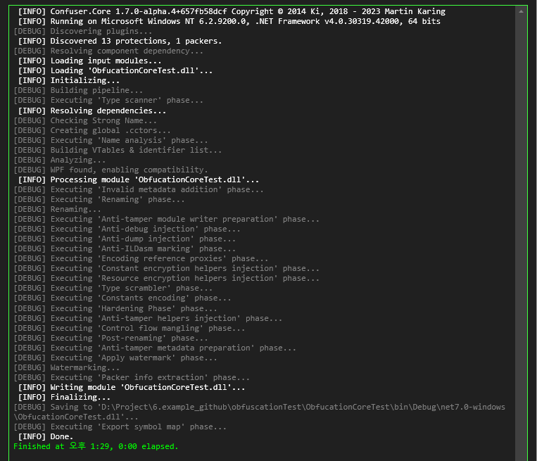

# 응용 프레임워크 난독화하기 2탄
### 오픈 소스 난독화 프로그램을 다뤄보기 .NET CORE
안녕하세요 개발자 이광석입니다.

.NET CORE에서의 난독화는 이전 .NET FRAMEWORK 편과 동일하게 한다면 동작되지 않을 겁니다.
만일 시도를 하신다면 다음과 같은 에러가 발생할겁니다.

### 그렇다면 .NET CORE로 빌드 된 WPF는 안되는것이냐? NO

별도의 커스텀 작업을 진행해주셔야하는데요.
**ConfuserEx**를 통해서 `probePath`를 넣으주시면 되는데 해당 프로그램에서 하나하나 처리하기 되면 오래걸리기 때문에
직접 파일을 수정해보도록 하겠습니다.

1. .csproj파일을 엽니다.
2. 아래 내용을 복사하지말고 참고만 해주세요.
   해당 파일 경로들은 제 PC에 설치되어있는 .net Core library 경로들입니다.
   그렇기 때문에 시도하시려는 분들이 해당 경로와 비슷하게 수정하셔야 합니다.
   ```xml
   <project outputDir="D:\Project\6.example_github\obfuscationTest\ObfucationCoreTest\bin\Debug\net7.0-windows" baseDir="D:\Project\6.example_github\obfuscationTest\ObfucationCoreTest\bin\Debug\net7.0-windows" xmlns="http://confuser.codeplex.com">
        <module path="ObfucationCoreTest.dll" />
        <probePath>C:\Program Files (x86)\dotnet\packs\Microsoft.NETCore.App.Ref\3.1.0\ref\netcoreapp3.1</probePath>
        <probePath>C:\Program Files (x86)\dotnet\packs\Microsoft.NETCore.App.Ref\5.0.0\ref\net5.0</probePath>
        <probePath>C:\Program Files (x86)\dotnet\packs\Microsoft.NETCore.App.Ref\6.0.21\ref\net6.0</probePath>
        <probePath>C:\Program Files (x86)\dotnet\packs\Microsoft.NETCore.App.Ref\7.0.10\ref\net7.0</probePath>
        <probePath>C:\Program Files (x86)\dotnet\shared\Microsoft.NETCore.App\3.1.32</probePath>
        <probePath>C:\Program Files (x86)\dotnet\shared\Microsoft.NETCore.App\5.0.17</probePath>
        <probePath>C:\Program Files (x86)\dotnet\shared\Microsoft.NETCore.App\6.0.21</probePath>
        <probePath>C:\Program Files (x86)\dotnet\shared\Microsoft.NETCore.App\7.0.10</probePath>
        <probePath>C:\Program Files (x86)\dotnet\packs\Microsoft.WindowsDesktop.App.Ref\3.1.0\ref\netcoreapp3.1</probePath>
        <probePath>C:\Program Files (x86)\dotnet\packs\Microsoft.WindowsDesktop.App.Ref\5.0.0\ref\net7.0</probePath>
        <probePath>C:\Program Files (x86)\dotnet\packs\Microsoft.WindowsDesktop.App.Ref\6.0.21\ref\net7.0</probePath>
        <probePath>C:\Program Files (x86)\dotnet\packs\Microsoft.WindowsDesktop.App.Ref\7.0.10\ref\net7.0</probePath>
        <probePath>C:\Program Files (x86)\dotnet\shared\Microsoft.WindowsDesktop.App\3.1.32</probePath>
        <probePath>C:\Program Files (x86)\dotnet\shared\Microsoft.WindowsDesktop.App\5.0.17</probePath>
        <probePath>C:\Program Files (x86)\dotnet\shared\Microsoft.WindowsDesktop.App\6.0.21</probePath>
        <probePath>C:\Program Files (x86)\dotnet\shared\Microsoft.WindowsDesktop.App\7.0.10</probePath>
        <probePath>C:\Program Files\dotnet\packs\Microsoft.NETCore.App.Ref\3.1.0\ref\netcoreapp3.1</probePath>
        <probePath>C:\Program Files\dotnet\packs\Microsoft.NETCore.App.Ref\5.0.0\ref\net5.0</probePath>
        <probePath>C:\Program Files\dotnet\packs\Microsoft.NETCore.App.Ref\6.0.21\ref\net6.0</probePath>
        <probePath>C:\Program Files\dotnet\packs\Microsoft.NETCore.App.Ref\7.0.10\ref\net7.0</probePath>
        <probePath>C:\Program Files\dotnet\shared\Microsoft.NETCore.App\3.1.32</probePath>
        <probePath>C:\Program Files\dotnet\shared\Microsoft.NETCore.App\5.0.17</probePath>
        <probePath>C:\Program Files\dotnet\shared\Microsoft.NETCore.App\6.0.21</probePath>
        <probePath>C:\Program Files\dotnet\shared\Microsoft.NETCore.App\7.0.10</probePath>
        <probePath>C:\Program Files\dotnet\packs\Microsoft.WindowsDesktop.App.Ref\3.1.0\ref\netcoreapp3.1</probePath>
        <probePath>C:\Program Files\dotnet\packs\Microsoft.WindowsDesktop.App.Ref\5.0.0\ref\net5.0</probePath>
        <probePath>C:\Program Files\dotnet\packs\Microsoft.WindowsDesktop.App.Ref\6.0.21\ref\net6.0</probePath>
        <probePath>C:\Program Files\dotnet\packs\Microsoft.WindowsDesktop.App.Ref\7.0.10\ref\net7.0</probePath>
        <probePath>C:\Program Files\dotnet\shared\Microsoft.WindowsDesktop.App\3.1.32</probePath>
        <probePath>C:\Program Files\dotnet\shared\Microsoft.WindowsDesktop.App\5.0.17</probePath>
        <probePath>C:\Program Files\dotnet\shared\Microsoft.WindowsDesktop.App\6.0.21</probePath>
        <probePath>C:\Program Files\dotnet\shared\Microsoft.WindowsDesktop.App\7.0.10</probePath>
    </project>
   ```
 3. `ConfuserEx` 든 `Confuser.CLI`든 닷넷 프레임워크때와 동일하게 난독화를 진행하시면 됩니다.
   
p.s 만일 관리하던 솔루션에 닷넷 프레임워크와 닷넷 코어가 섞여있다면 각각 닷넷 프레임워크와 닷넷코어 각각 .csproj를 만들어주셔야합니다.